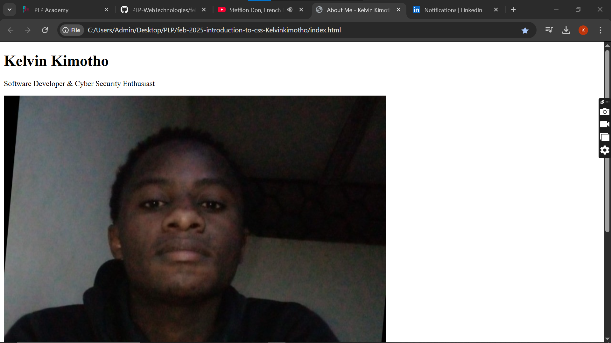

# Introduction to CSS

## Objectives
Link an external CSS file to an HTML document.
Apply basic styling using selectors.
Use colors, fonts, and spacing effectively.

## Instructions

Create a style.css file.
Apply CSS to a HTML page.
Style elements using:
Classes and IDs.
Color and typography.
Margins, paddings, and borders.

>[!NOTE]
>  - Include at least:
>  - Use of 3 selectors
>  - Style an image
>  - Margin, Padding & Borders
>  - Different font

# Tasks
 - Link an external CSS file.
 - Apply at least 3 different selectors.
 - Improve readability and aesthetics.
My page appearance without css
 
My page with css styling
  

Happy Coding! 💻✨
